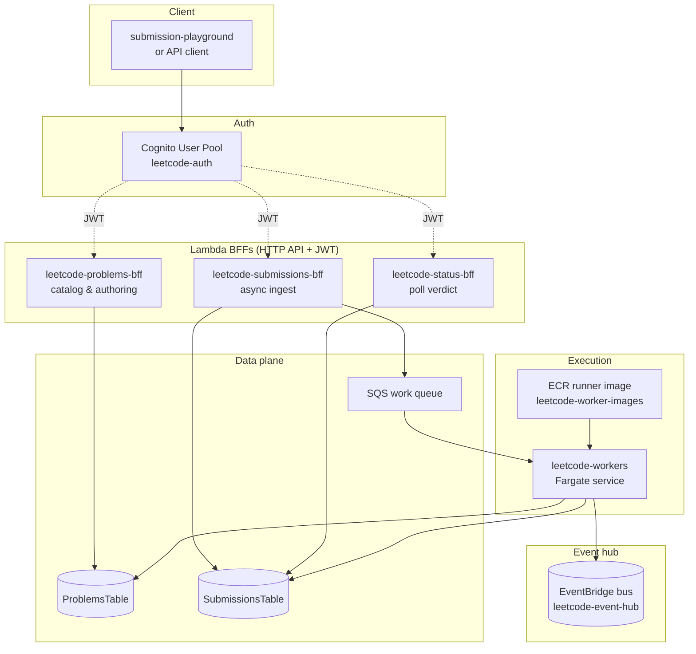
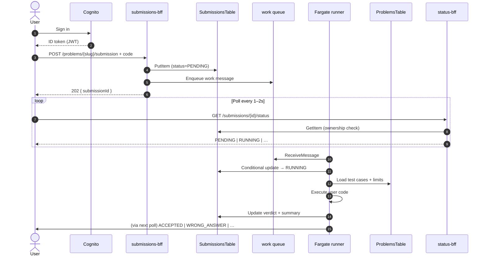
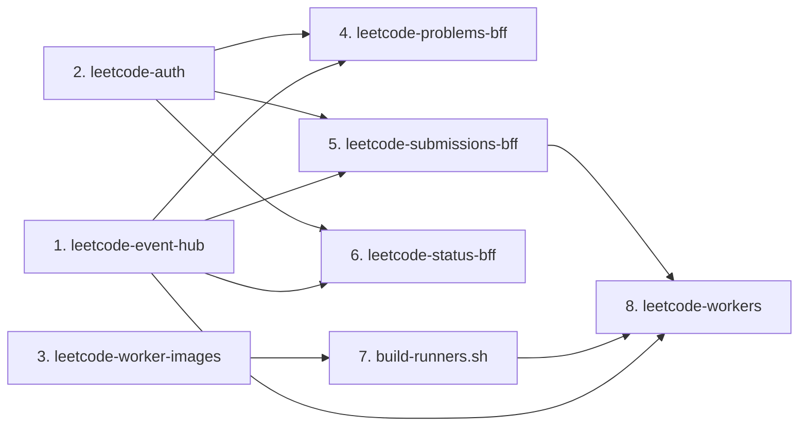

# leetcode-app

**AWS serverless coding platform** — browse problems, submit solutions, and get async verdicts. Built with **Serverless Framework v4**, **Nx**, and **TypeScript**. Event-sourced / CQRS at the edge; **Fargate** runs user code in a warm worker pool.

> v1 is an **internal MVP sandbox** for trusted users in `ap-southeast-1`. Production-grade untrusted-code isolation (gVisor, custom seccomp) is a follow-on path — see [`design-research.md`](./design-research.md).

Sibling repos: [`../pastebin-app/`](../pastebin-app/) · [`../url-shortener-app/`](../url-shortener-app/) — same monorepo conventions, bus wiring, and deploy order patterns.

---

## At a glance

| | |
|---|---|
| **Languages** | Python 3.12 · JavaScript (Node 20) — one combined ECR runner image |
| **Auth** | Cognito JWT on every BFF route |
| **Problems** | Inline test cases in DynamoDB (no separate S3 bucket at v1) |
| **Submissions** | Async: HTTP 202 → SQS → Fargate → poll status |
| **Region / stage** | `ap-southeast-1` · default stage `dev` |
| **Not in v1** | Contests · leaderboard · compiled languages · public anonymous browsing |

---

## Architecture

Seven deployable units share one **EventBridge** bus. Three **Lambda BFFs** sit behind HTTP API + JWT authorizer. A **Fargate** fleet long-polls an SQS work queue and writes results back to DynamoDB.



### Submission lifecycle

The client never blocks on execution. It accepts a `submissionId`, then polls until the row reaches a terminal status.



### Deploy dependency graph

Stacks wire together through CloudFormation `${cf:…}` outputs — no SSM at MVP.



---

## Stacks

| Stack | Directory | Role |
|-------|-----------|------|
| Event hub | [`leetcode-event-hub/`](./leetcode-event-hub/) | Shared EventBridge bus + archive |
| Auth | [`leetcode-auth/`](./leetcode-auth/) | Cognito User Pool + app client (exported to all BFFs) |
| Worker images | [`leetcode-worker-images/`](./leetcode-worker-images/) | Combined Python + Node ECR repository |
| Problems BFF | [`leetcode-problems-bff/`](./leetcode-problems-bff/) | Problem catalog, authoring, inline test cases |
| Submissions BFF | [`leetcode-submissions-bff/`](./leetcode-submissions-bff/) | Accept code, write row, enqueue SQS |
| Status BFF | [`leetcode-status-bff/`](./leetcode-status-bff/) | Poll submission verdict (ownership-scoped) |
| Workers | [`leetcode-workers/`](./leetcode-workers/) | Fargate fleet — SQS consumer + code runner |

**Local UI:** [`submission-playground/`](./submission-playground/) — Vite + React app for end-to-end dev against deployed BFFs.

### Design invariants

- **Workers write DDB directly** at v1 — status-bff polls the row; no CDC listener yet.
- **One combined runner image** — language chosen by the `language` field on the submission.
- **Test cases live in the problem row** — capped by byte limits; no Redis, no test-case S3 bucket.
- **Cross-stack wiring** uses CloudFormation outputs only.

Full rationale: [`design-research.md`](./design-research.md) · textbook brief: [`system_design__architecting_a_scalable_coding_platform_like_leetcode.md`](./system_design__architecting_a_scalable_coding_platform_like_leetcode.md)

---

## API surface

All BFF routes require a valid **Cognito ID token** unless noted.

### Problems BFF

| Method | Path | Description |
|--------|------|-------------|
| `GET` | `/health` | Liveness |
| `GET` | `/problems` | Paginated problem list |
| `GET` | `/problems/{slug}` | Problem detail + starter code + public test metadata |
| `POST` | `/problems` | Create problem (slug lock + validation) |
| `GET` | `/me/problems` | Problems authored by caller |

### Submissions BFF

| Method | Path | Description |
|--------|------|-------------|
| `GET` | `/health` | Liveness |
| `POST` | `/problems/{slug}/submission` | Submit code → `202` + `submissionId` |
| `GET` | `/me/submissions` | Caller's submission history |

### Status BFF

| Method | Path | Description |
|--------|------|-------------|
| `GET` | `/health` | Liveness |
| `GET` | `/submissions/{submissionId}/status` | Poll until terminal verdict |

Supported `language` values: `python` · `javascript`.

---

## Prerequisites

- **Node.js 20+**
- **Yarn** (workspaces) or `npm install` as fallback
- **AWS credentials** with permission to deploy Serverless stacks
- **Docker** — required to build and push the runner image (`scripts/build-runners.sh`)

---

## Getting started

```bash
yarn install
yarn typecheck
```

### Deploy (dev)

Deploy in order — later stacks import outputs from earlier ones:

```bash
yarn package:event-hub && yarn deploy:event-hub   # bus first
yarn deploy:auth
yarn deploy:worker-images
yarn deploy:problems-bff
yarn deploy:submissions-bff
yarn deploy:status-bff
./scripts/build-runners.sh                          # push runner image to ECR
yarn deploy:workers                                 # only after image is in ECR
```

| Stack | CloudFormation name (dev) |
|-------|---------------------------|
| Event hub | `leetcode-event-hub-dev` |
| Auth | `leetcode-auth-dev` |
| Worker images | `leetcode-worker-images-dev` |
| Problems BFF | `leetcode-problems-bff-dev` |
| Submissions BFF | `leetcode-submissions-bff-dev` |
| Status BFF | `leetcode-status-bff-dev` |
| Workers | `leetcode-workers-dev` |

Prefer **Nx / yarn scripts** over invoking `serverless` directly when a target exists. Run `yarn show:projects` or `yarn graph` to explore the workspace.

---

## Local development

### Submission playground

Interactive UI for the full submit → poll flow against live dev APIs:

```bash
yarn dev:playground
```

Opens at **http://localhost:5173**. See [`submission-playground/README.md`](./submission-playground/README.md) for auth, seeding, and troubleshooting.

### Dev JWT & seed scripts

Never commit passwords or tokens. Use a local `.env` (gitignored) or env vars:

```bash
# One-time: create or reset a dev Cognito user
export COGNITO_USERNAME='you@example.com'
export COGNITO_PASSWORD='…'
yarn set:dev-user

# Mint an ID token for API calls / playground paste
yarn mint:jwt

# Seed the canonical two-sum problem (requires PROBLEMS_API + JWT in env)
yarn seed:two-sum
```

Token workflow details: [`.cursor/skills/leetcode-dev-jwt/SKILL.md`](./.cursor/skills/leetcode-dev-jwt/SKILL.md)

---

## Repository layout

```
leetcode-app/
├── leetcode-event-hub/          # EventBridge bus
├── leetcode-auth/               # Cognito
├── leetcode-worker-images/      # ECR repo for combined runner
├── leetcode-problems-bff/       # Problems API + DDB
├── leetcode-submissions-bff/    # Submit API + SQS
├── leetcode-status-bff/         # Status polling API
├── leetcode-workers/            # Fargate + dispatcher
├── submission-playground/       # Local React dev UI
├── scripts/                     # JWT mint, seed, runner build
├── design-research.md           # Architecture deep dive
└── AGENTS.md                    # Agent / contributor conventions
```

---

## v1 scope (and what we skipped)

**In scope**

- Python and JavaScript only — interpreted, no compile step
- JWT-protected catalog and submission APIs
- Async execution with Fargate warm pool (`desiredCount: 10`, autoscale to 50)
- Inline test cases in DynamoDB
- EventBridge bus declared for future analytics / leaderboard consumers

**Explicitly out of scope**

- Contests, leaderboard, two-phase grading
- Compiled languages (Java, Go, C++, Rust)
- Anonymous problem browsing
- Redis, CDN, read replicas

See `design-research.md` sections 3 and 10 for threat model, sandbox limits, and the production isolation path.

---

## Related documentation

| Document | Contents |
|----------|----------|
| [`design-research.md`](./design-research.md) | Full AWS architecture, DDB schemas, worker contract |
| [`system_design__architecting_a_scalable_coding_platform_like_leetcode.md`](./system_design__architecting_a_scalable_coding_platform_like_leetcode.md) | Source system-design brief |
| [`CHANGES_2026-06-24.md`](./CHANGES_2026-06-24.md) | Design change log |
| [`AGENTS.md`](./AGENTS.md) | Deploy order, conventions for contributors and agents |
| [`../pastebin-app/design-research.md`](../pastebin-app/design-research.md) | Sister repo format reference |
