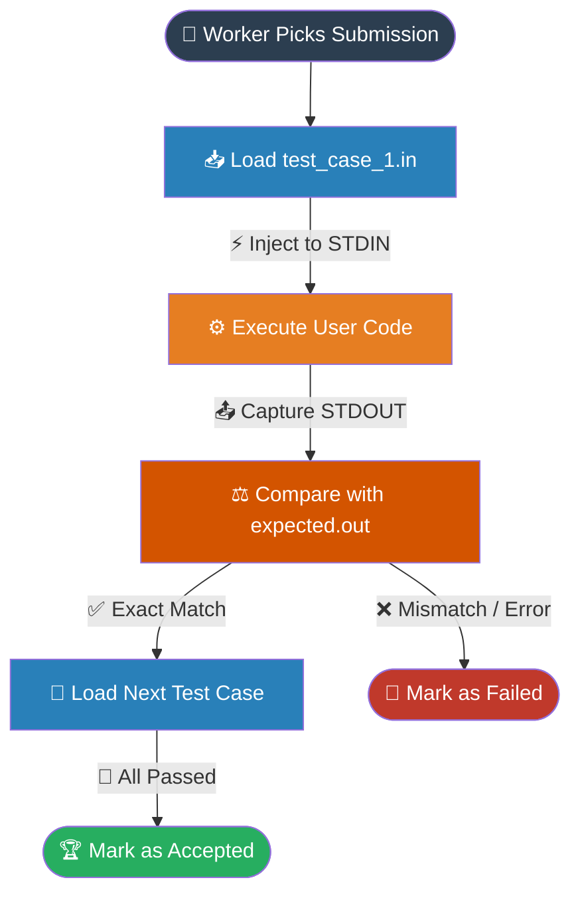

# System Design: Architecting a Scalable Coding Platform like LeetCode

## Glossary

The following table defines the critical technical terms and system design concepts utilized in building a highly scalable coding platform.

| Term | Definition | System Context |
| :--- | :--- | :--- |
| **Message Queue** | An asynchronous communication mechanism that temporarily stores messages until they are processed by a consumer. | Used to buffer massive spikes of code submissions during contests, preventing system overloads. |
| **Sandboxing** | A security mechanism for separating running programs, often used to execute untested or untrusted code safely. | Prevents malicious user submissions from accessing system resources, databases, or other users' environments. |
| **Cold Start** | The delay experienced when a serverless function or container is invoked for the first time or after a period of inactivity. | Avoided in this architecture by pre-scaling Docker containers before contest traffic spikes. |
| **Polling** | A client-side technique of repeatedly requesting data from a server at regular intervals to check for state changes. | Used by the client application to check the status of a code execution without holding open persistent connections. |
| **Redis ZSET** | A Redis Sorted Set data structure that associates every unique string member with a floating-point score, maintaining order automatically. | Powers the real-time leaderboard, enabling extremely fast `O(log n)` updates and top-N queries. |
| **seccomp** | Secure computing mode; a Linux kernel feature that restricts the system calls a process can make. | Applied to execution containers to strictly limit what untrusted user code can do at the OS level. |
| **Two-Phase Processing** | A strategy of splitting a heavy workload into an immediate partial execution and a deferred complete execution. | Evaluates code against 10% of test cases during a contest for fast feedback, running the remaining 90% post-contest. |

## Core Concepts

Building a competitive programming platform requires balancing high availability for browsing problems with highly secure, isolated, and scalable compute resources for executing untrusted user code. 

### System Requirements and API Design

To effectively design the system, we must map user actions to functional requirements and system constraints to non-functional requirements. 

**Functional Requirements:**
- Users can browse a catalog of problems, viewing descriptions, constraints, and examples.
- Users can submit code in various languages, execute it against predefined test cases, and receive immediate pass/fail feedback.
- Users can participate in timed, high-concurrency coding contests (e.g., 2 hours, 4 questions).
- The system must maintain a real-time leaderboard showing the top 50 participants based on execution accuracy and speed.

**Non-Functional Requirements:**
- **High Availability:** The problem-viewing interface must remain online even if the execution engine is overwhelmed.
- **Strict Security:** User-submitted code is fundamentally untrusted and must be executed in absolute isolation.
- **Scalability:** The system must handle massive, sudden traffic spikes at the start and end of timed contests.

To support these requirements, the system relies on a RESTful API structure.

| HTTP Method | Endpoint | Description |
| :--- | :--- | :--- |
| `GET` | `/problems?start={start}&end={end}` | Retrieves a paginated list of all available coding problems. |
| `GET` | `/problems/:problem_id` | Fetches specific problem details, constraints, and starter code templates. |
| `POST` | `/problems/:problem_id/submission` | Accepts untrusted user code for evaluation against test cases. |
| `GET` | `/submissions/:submission_id/status` | Polls the system for the current execution status of a submitted solution. |
| `GET` | `/contests/:contest_id/leaderboard` | Fetches the real-time ranking of the top 50 users in a specific contest. |

### High-Level Architecture and Separation of Concerns

A monolithic architecture would fail immediately under contest conditions. If problem viewing and code execution shared the same resources, a sudden spike in CPU-heavy code submissions would crash the web servers, preventing users from even reading the problems.

The solution requires decoupling the architecture into three distinct components:
1. **Problems Service:** A standard three-tier web architecture (Load Balancer → Web Servers → Read-Replica Database) dedicated entirely to serving read-heavy traffic for problem descriptions.
2. **Code Evaluation Service:** A lightweight API that receives user submissions, performs basic validation, and immediately offloads the heavy lifting.
3. **Code Execution Workers:** A fleet of independent worker nodes that pull submissions, compile the code, run test cases, and write the results back to the database.

To connect the Evaluation Service and the Execution Workers, we introduce a **Message Queue**. During a contest, 5,000 submissions might arrive in the first minute. The queue acts as a shock absorber. The Evaluation Service drops the submission into the queue in milliseconds and returns a `submission_id` to the user. The Execution Workers then pull from this queue at their maximum safe capacity.


### Secure Code Execution Environment

Executing untrusted code is the most dangerous operation in this system. Malicious code could attempt to read environment variables, execute fork bombs to exhaust memory, or establish outbound network connections.

While Serverless functions (like AWS Lambda) seem appealing for automatic scaling, they suffer from **cold starts** (delays of 500ms to 2 seconds when spinning up new instances). During a contest spike, thousands of users would hit this latency penalty simultaneously. 

Instead, **Containerization (Docker)** is the optimal choice. Containers allow the platform to pre-scale. The system can spin up hundreds of idle containers 5 minutes before a contest begins, entirely eliminating cold starts. 

Each container is heavily sandboxed:
- CPU limits are strictly enforced (e.g., maximum 0.5 vCPU).
- Memory is capped (e.g., 512 MB) to prevent out-of-memory crashes from affecting the host node.
- Network access is completely disabled.
- The filesystem is mounted as read-only.
- System calls are restricted using `seccomp` profiles.

### Asynchronous Result Retrieval

Because code execution takes time (compilation, running dozens of test cases), keeping the initial HTTP `POST` request open until completion is dangerous. It forces the server to hold thousands of concurrent open connections, leading to memory exhaustion.

Instead, the system uses **Polling**. The initial `POST` returns immediately with a tracking ID. The client application then makes lightweight `GET` requests every 1-2 seconds to check the status. 
- *Why not WebSockets?* WebSockets are bidirectional and stateful. We only need one-way updates, making the overhead of maintaining persistent WebSocket connections unnecessary.
- *Why not Server-Sent Events (SSE)?* SSE also requires long-lived open HTTP connections, which drains server resources during massive traffic spikes.

### Real-Time Leaderboard Implementation

During a contest, thousands of developers submit solutions, causing the leaderboard to shift every few seconds. A traditional SQL query like `SELECT * FROM leaderboard ORDER BY score DESC LIMIT 50` would require a full table scan and sort on every request, quickly bringing the database to a halt.

The solution is an in-memory data structure: **Redis Sorted Sets (ZSET)**. Redis maintains the order of elements automatically using a skip list. 
- Updating a user's score (`ZADD`) takes `O(log n)` time.
- Querying the top 50 users (`ZREVRANGE`) takes `O(log n + 50)` time.

Because Redis Sorted Sets only allow a single numeric score per user, the system must **pack** multiple scoring dimensions (Points + Time Penalty) into a single floating-point number. A common approach is the *Big Multiplier Formula*, where points are multiplied by a massive number, and the time taken (in seconds) is subtracted, ensuring that higher points always win, but lower times break ties.

### Managing Massive Traffic Spikes

Pre-scaling containers and using a message queue handles standard spikes, but extreme scenarios require business-logic trade-offs. 

**Two-Phase Processing** is a battle-tested strategy for managing contest load. 
- **Phase 1 (During Contest):** When a user submits code, the worker only runs it against a small subset (e.g., 10%) of the test cases. This provides the user with immediate feedback within seconds, allowing them to debug and resubmit without clogging the execution queue.
- **Phase 2 (Post-Contest):** Once the 2-hour contest ends, the system runs a massive batch job to execute all final submissions against the remaining 90% of the hidden test cases. Since the contest is over, users no longer need real-time feedback, and the system can process these at its own pace.

## Examples

The following practical examples demonstrate how the core concepts are implemented in code and system configurations.

### Example 1: Client-Side Polling Mechanism

When a user submits code, the frontend must poll the backend to retrieve the asynchronous execution results. Here is an example implementation in JavaScript.

```javascript
// Function to submit code and begin polling
async function submitAndPoll(problemId, codePayload) {
    // 1. Submit the code (Returns immediately)
    const submitResponse = await fetch(`/problems/${problemId}/submission`, {
        method: 'POST',
        body: JSON.stringify({ code: codePayload })
    });
    const { submission_id } = await submitResponse.json();

    // 2. Poll for results every 1.5 seconds
    const intervalId = setInterval(async () => {
        const statusResponse = await fetch(`/submissions/${submission_id}/status`);
        const result = await statusResponse.json();

        if (result.status === 'COMPLETED') {
            clearInterval(intervalId);
            displaySuccess(result.metrics); // Show memory/CPU usage
        } else if (result.status === 'FAILED' || result.status === 'TIMEOUT') {
            clearInterval(intervalId);
            displayError(result.error_message);
        }
        // If status is 'PENDING' or 'RUNNING', the loop continues
    }, 1500);
}
```

### Example 2: Container Sandboxing Configuration

To guarantee strict isolation, the Execution Worker spins up a Docker container for every submission. The following command demonstrates the strict resource limits applied to prevent malicious behavior.

```bash
# Docker run command executed by the worker node
docker run --rm \
  --cpus="0.5" \                  # Limit to half a CPU core
  --memory="512m" \               # Hard cap memory to 512 Megabytes
  --network="none" \              # Disable all network access (no internet)
  --read-only \                   # Prevent writing to the root filesystem
  --security-opt="no-new-privileges" \ # Prevent privilege escalation
  --security-opt seccomp=custom_profile.json \ # Restrict Linux system calls
  python-runner:latest \
  python3 execute_user_code.py
```

### Example 3: Test Case Evaluation Workflow

The evaluation process must be language-agnostic. Instead of writing custom testing frameworks for Java, Python, and C++, the system uses standard Input/Output file streams. 



### Example 4: Redis Leaderboard Scoring

To pack points and time into a single Redis score, we use a calculated float. Assume a contest where points are paramount, and time (in seconds) is the tie-breaker. 

*Formula:* `Score = (Points * 1000000) - Time_Taken`

If User A solves 3 problems (300 points) in 1500 seconds, and User B solves 3 problems (300 points) in 1200 seconds:
- User A Score: `(300 * 1000000) - 1500 = 299,998,500`
- User B Score: `(300 * 1000000) - 1200 = 299,998,800`

User B has a higher score and will rank above User A.

```redis
# Redis CLI Commands executed by the Contest Service
# Add/Update users in the leaderboard (ZADD key score member)
> ZADD contest_123_leaderboard 299998500 "user_A"
(integer) 1
> ZADD contest_123_leaderboard 299998800 "user_B"
(integer) 1

# Fetch top 2 users, highest score first (ZREVRANGE key start stop WITHSCORES)
> ZREVRANGE contest_123_leaderboard 0 1 WITHSCORES
1) "user_B"
2) "299998800"
3) "user_A"
4) "299998500"
```

## Summary

Architecting a scalable coding platform requires solving complex challenges related to untrusted code execution, massive concurrency, and real-time state management. By decoupling the architecture, the system guarantees that browsing capabilities remain highly available even when the execution engine is under extreme load. 

The most critical takeaways from this design are:
- **Security First:** Containerization with strict resource limits and disabled networking is mandatory when executing untrusted user code.
- **Asynchronous Processing:** Utilizing a Message Queue combined with client-side polling prevents the system from being overwhelmed by persistent connections during traffic spikes.
- **In-Memory Speed:** Relational databases are insufficient for high-frequency leaderboard updates; Redis Sorted Sets are required to achieve the necessary `O(log n)` performance.
- **Strategic Trade-offs:** Implementing Two-Phase Processing during contests allows the platform to support 10x more concurrent users by deferring heavy compute tasks until the contest concludes. 

By implementing these patterns, engineers can build resilient, high-performance platforms capable of supporting thousands of simultaneous developers in competitive environments.